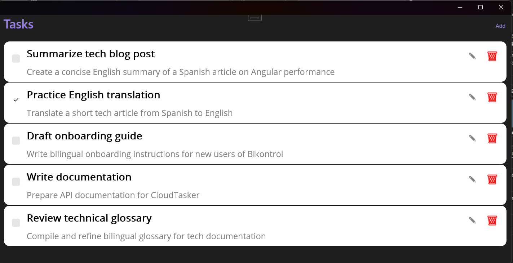
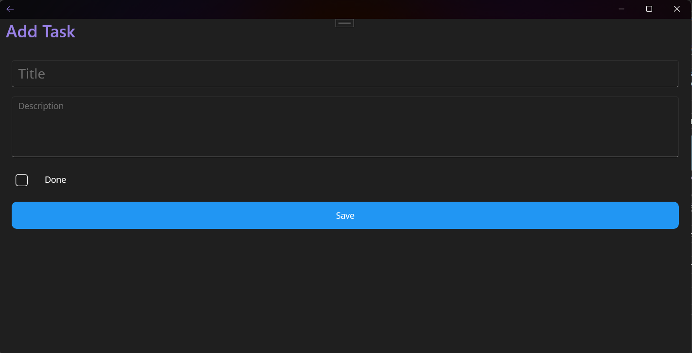
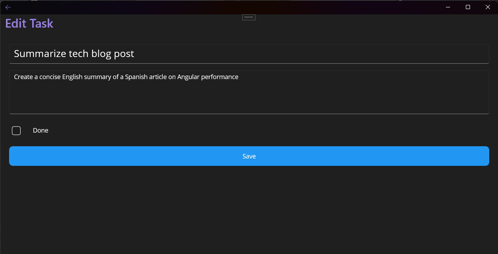

# CloudTasker ☁️✅

**CloudTasker** is a serverless task manager built with **Azure Functions** and **Cosmos DB**.  
It allows you to create, update, delete, and list tasks in a fully cloud-native environment and includes a **cross-platform MAUI app** for task management.



---

## ✨ Features

- 📌 Create, read, update, and delete tasks
- 🗂️ Persistent storage with Azure Cosmos DB
- ⚡ Serverless execution with Azure Functions
- 🖥️ Cross-platform frontend with .NET MAUI (Windows, Android, iOS)
- ✅ MVVM architecture for frontend
- 🔑 Config-driven setup via `appsettings.json`
- 🌍 Ready for deployment to Azure Functions

> 🧪 Still in development – UI and additional features like authentication, push notifications, and offline support are being added iteratively.

---

## 🏗️ Project Structure

### Backend (CloudTasker.Functions)

- `Contracts` → DTOs and mapping configuration (e.g., `TaskWriteRequest`, `TaskResponse`)  
- `Data` → Repository interfaces and implementations (`ITaskRepository`, `CosmosTaskRepository`, `InMemoryTaskRepository`)  
- `Functions` → Azure Functions entry points (`TaskFunctions`)  
- `Infra` → Infrastructure helpers (e.g., `HttpJson`)  
- `Models` → Core business entities (`TaskItem`)  
- `Services` → Reserved for additional business logic/services  

### Frontend (CloudTasker.App)

- `Views` → Pages (`TasksPage.xaml`, `TaskDetailPage.xaml`)  
- `ViewModels` → MVVM view models (`TasksViewModel`)  
- `Models` → TaskItem model for frontend  
- `Services` → API communication layer (`TaskService`)  
- `Resources` → App icons, fonts, images, styles  
- `Platforms` → Platform-specific projects (Android, iOS, Windows)

---

## 🛠 Tech Stack

- **Serverless**: Azure Functions (.NET Isolated, v4)  
- **Database**: Azure Cosmos DB (SQL API)  
- **Frontend**: .NET MAUI (Windows, Android, iOS)  
- **Language**: C# 12 / .NET 8  
- **CI/CD**: GitHub Actions (build + deploy to Azure)  
- **Testing**: Unit tests (InMemory repository, xUnit)  

---

## 📚 API Documentation

- 🌐 **Live Docs (Postman):** [CloudTasker API Docs](https://www.postman.com/santidev21/cloudtasker-api-docs/collection/y2tugv2/cloudtasker-api)  
- 📦 **Collection JSON (local):** [`docs/CloudTasker-API.postman_collection.json`](./backend/CloudTasker.Functions/CloudTasker.Api/Docs/CloudTasker-API.postman_collection.json)

---

## 🚀 Getting Started

### 🧩 Prerequisites

- [.NET 8 SDK](https://dotnet.microsoft.com/download)  
- [Azure Functions Core Tools](https://learn.microsoft.com/azure/azure-functions/functions-run-local)  
- An [Azure Cosmos DB account](https://learn.microsoft.com/azure/cosmos-db/)  
- Optional: Visual Studio 2022/2023 with MAUI workload  

### ⚙️ Local Setup

1. Clone the repository:
```bash
git clone https://github.com/santidev21/cloudtasker.git
cd cloudtasker
```

2. Restore backend packages and run Azure Functions locally:
```bash
cd backend/CloudTasker.Functions/CloudTasker.Api
dotnet restore
func start
```

3. Open the MAUI frontend in Visual Studio and run on your platform of choice (Windows / Android / iOS).

### 📝 Usage

- Launch the MAUI app
- The app fetches tasks from the deployed Azure Functions backend
- ✅ Tasks can be deleted (implemented)
- ⚡ Add / Edit task UI available, navigation wired (logic to connect to backend is pending)
- Pull-to-refresh updates task list from backend

## 🖥 CI/CD

- Build & Deploy handled via GitHub Actions

Workflow:
- On push to main, backend is built and tested
- Functions are deployed automatically to Azure
- MAUI app can be packaged locally for Android/iOS/Windows
Notes: Ensure your Azure credentials are set as GitHub Secrets for deployment.

## 🖼 Screenshots

### 🔹 Tasks List


### 🔹Add Task Form


### 🔹Edit Task Form

